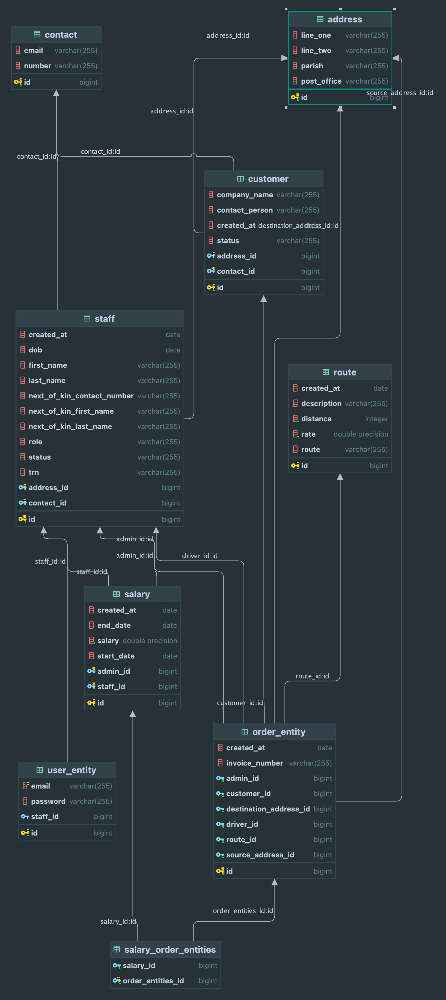

# Java Haulage and Trucking

Java Haulage and Trucking is a leading transportation company dedicated to providing reliable and efficient haulage and trucking solutions. With a focus on professionalism, safety, and customer satisfaction, we deliver a comprehensive range of services tailored to meet the diverse needs of our clients.

## What's in this project?

- Server
- Client
- Documentations

## Get Started

- Java 21
- IntelliJ IDEA Ultimate (Community Edition) Recommended or Eclipse
- MySQL

> NOTE: If you are using Eclipse
> 
> Setup plugin for Eclipse [Link](https://projectlombok.org/setup/eclipse) to add support for lombok

## Assessment

| Deliverables                                        | Weight | Status |
|-----------------------------------------------------|--------|--------|
| UML Class and Database ER Diagrams                  | 5%     | ✅      |
| Comments, Programming Conventions and Documentation | 5%     | ✅      |
| Classes, Interfaces, Inheritance and Polymorphism   | 10%    | ✅      |
| Database Connectivity (mandatory)                   | 10%    | ✅      |
| Exception Handling, User & Data Input Validation    | 5%     | ✴️     |
| Events Logging using Log4j2                         | 5%     | ✅️     |
| Client/Server Networking Model                      | 15%    | ✅️     |
| Graphical User Interface                            | 10%    | ✅️     |
| User manual                                         | 5%     | ✴️️    |
| System Functionalities Described Above              | 30%    | ✴️️    |

## Core Module Concepts (Grade Breakdown)

| Deliverables                                         | Weight | Status |
|------------------------------------------------------|--------|--------|
| Database design - UML Class and Database ER Diagrams | 5%     | ✅️     |
| Comments, Programming Conventions and Documentation  | 5%     | ✅️     |
| Classes, Interfaces, Inheritance and Polymorphism    | 5%     | ✅️     |
| Database Connectivity                                | 10%    | ✅️     |
| Exception Handling, User & Data Input Validation     | 5%     | ✴️     |
| Events Logging using Log4j2                          | 5%     | ✅️     |
| Networking – Threading, etc.                         | 10%    | ✅️     |
| Graphical User Interface                             | 10%    | ✅️     |
| User Manual                                          | 5%     | ✴️     |

## System Functionalities (Admin)

| Deliverables                                                           | Weight | Status |
|------------------------------------------------------------------------|--------|--------|
| Log into the dashboard with their Staff ID and password                | 3%     | ✴️     |
| Add a haulage or delivery request record to the system.                | 3%     | ✅️     |
| Add a staff record to the system.                                      | 3%     | ✅️     |
| Add a customer record to the system.                                   | 3%     | ✅️     |
| Add the routes and rates into the system.                              | 3%     | ✅️     |
| Select the routes from a dropdown list when booking a haulage request. | 3%     | ✅️     |
| See whether a customer has an outstanding balance.                     | 3%     | ✴️     |

## System Functionalities (Other)

| Deliverables                                                                   | Weight | Status |
|--------------------------------------------------------------------------------|--------|--------|
| Authentication                                                                 | %      | ✴️     |
| Automatically assign the rates to the invoice for the trip.                    | 5%     | ✅️️    |
| Automatically flag a customer’s account for outstanding balances over 30 days. | 4%     | ✴️     |
| Generate pay slips for all employees’ salaries.                                | 5%     | ✅️️    |
| Generate reports based on specific requirements.                               | 5%     | ✴️     |
| Chat feature                                                                   | 5%     | ✅️️    |

#### Bonus

> Applications capable of supporting real-time/live chat between users at both locations will 
> be given an extra credit of **5 marks**.

# UML Class Diagram

# Database ERD Diagram

